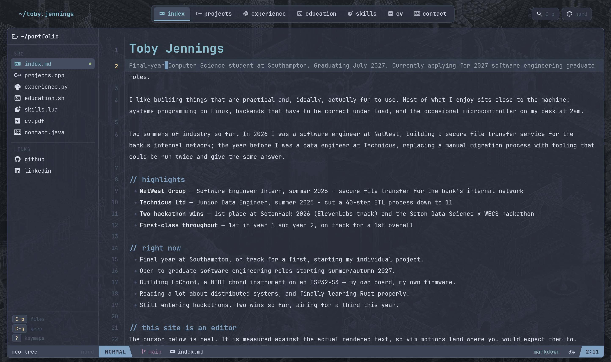

# portfolio

My personal site, [tobyjennings.dev](https://tobyjennings.dev) — a portfolio that behaves like Neovim.



Each page is a buffer in a file tree, and the cursor is real: it is measured against the actually
rendered text, so vim motions land on the character you expect. There is a working command line,
a Telescope-style fuzzy finder, live grep across every page, a which-key leader menu, and seven
colorschemes.

## Keys

| | |
|---|---|
| `h` `j` `k` `l` | move |
| `w` `b` `e` | by word |
| `gg` `G` `{` `}` | jump |
| `C-d` `C-u` `C-f` `C-b` | scroll |
| `/` `n` `N` | search the buffer |
| `C-p` `C-g` | find files / live grep |
| `:` | command line — try `:colorscheme` or `:neofetch` |
| `Space` | leader (hold to see the menu) |
| `gx` | follow the link on the current line |
| `?` | every keymap |

## Running it

```bash
npm install
npm run dev
```

`npm run build` produces `dist/`. Built with React 19 and Vite; the CV is rendered in the buffer
with pdf.js, and JetBrains Mono is self-hosted so that every glyph advances by the same width —
the cursor grid depends on it.
